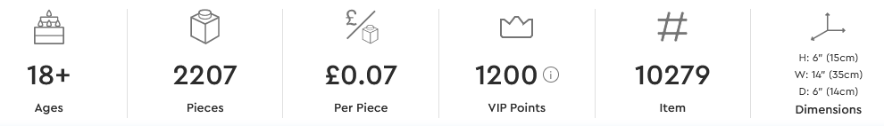

# Piece Cost

A simple web extension to add the £ cost per Lego piece to sets on Lego's website.

Currently only supports £.

https://addons.mozilla.org/en-GB/firefox/addon/piece-cost/

## Example

